# 🚀 NEXORA - AI Voice Chat Assistant

## 📱 Mobile Frontend Component of the Agentic System

<div align="center">


_Intelligent Voice Conversations with AI - Mobile Client_

[](https://flutter.dev)
[](https://dart.dev)
[](https://websockets.spec.whatwg.org/)

**🏆 Developed by Team RexFlow for [Nexora 1.0 Inter-University Datathon 2025](https://nexora-v1.com/)**

_Where AI meets innovation and data fuels transformation!_

</div>

---

## 🌟 About This Component

This repository contains the **mobile frontend application** of the **Agentic System of Nexora AI** - a comprehensive AI-powered ecosystem. This Flutter-based mobile client provides an intuitive interface for users to interact with the sophisticated AI agents and services that power the Nexora AI platform.

### 🔗 System Architecture Overview

The **Agentic System of Nexora AI** consists of multiple interconnected components:

- **🎯 This Repository**: Mobile Frontend (Flutter) - User interaction layer
- **🤖 AI Agent Backend**: Intelligent conversation processing and orchestration
- **🗣️ Voice Processing Service**: Real-time speech-to-text and text-to-speech
- **💾 Data Management Layer**: User data, conversation history, and analytics
- **🔐 Authentication Service**: Secure user management and session handling
- **📡 WebSocket Gateway**: Real-time communication infrastructure

### 🎯 Competition Context

This project was developed by **Team RexFlow** for the **Nexora 1.0 Inter-University Datathon 2025**, showcasing a complete agentic AI system that demonstrates advanced capabilities in natural language processing, real-time communication, and intelligent user interaction.

---

## ✨ Mobile App Features

### 🎤 **Voice Chat Intelligence**

- **Real-time Voice Recognition**: Advanced speech-to-text processing via backend AI services
- **AI Voice Responses**: Natural text-to-speech with emotional context from agentic system
- **WebSocket Communication**: Ultra-low latency real-time conversations with AI agents
- **Audio Processing**: High-quality 16kHz mono audio recording and playback

### 🎨 **Beautiful Animated UI**

- **Dynamic Voice Visualizations**: Pulsating circles and wave animations
- **State-aware Animations**: Different animations for listening, speaking, and idle states
- **Modern Material Design**: Clean, intuitive interface with Google Fonts
- **Responsive Feedback**: Visual indicators for connection status and permissions

### 🔐 **Authentication System**

- **Secure Login/Signup**: User authentication with OTP verification through backend services
- **Session Management**: Persistent user sessions with the agentic system
- **Privacy Protection**: Secure handling of user data across the platform

### 💬 **Chat Management**

- **Chat History**: Persistent conversation storage with AI agents
- **Multiple Chat Modes**: Voice and text chat support with intelligent agents
- **Real-time Updates**: Live conversation synchronization with backend services

### 🛠 **Technical Excellence**

- **Clean Architecture**: Feature-based modular structure optimized for agent communication
- **Dependency Injection**: Injectable pattern with GetIt
- **State Management**: BLoC pattern for predictable state handling with async AI responses
- **Auto Routing**: Type-safe navigation with auto_route
- **Error Handling**: Comprehensive error management for distributed system interactions

---

## 📱 Screenshots

<div align="center">

### Voice Chat Interface


_Animated voice interface with real-time AI conversation_

### Main Chat Window


_Interactive chat interface with modern design_

### Authentication Flow

  

_Splash Screen &nbsp;&nbsp;&nbsp;&nbsp;&nbsp;&nbsp;&nbsp;&nbsp;&nbsp;&nbsp;&nbsp;&nbsp;&nbsp;&nbsp;&nbsp;&nbsp;&nbsp;&nbsp;&nbsp;&nbsp;&nbsp;&nbsp;&nbsp;&nbsp; Login Screen &nbsp;&nbsp;&nbsp;&nbsp;&nbsp;&nbsp;&nbsp;&nbsp;&nbsp;&nbsp;&nbsp;&nbsp;&nbsp;&nbsp;&nbsp;&nbsp;&nbsp;&nbsp;&nbsp;&nbsp;&nbsp;&nbsp;&nbsp;&nbsp; OTP Verification_

### Chat Features & Management

  

_Chat History &nbsp;&nbsp;&nbsp;&nbsp;&nbsp;&nbsp;&nbsp;&nbsp;&nbsp;&nbsp;&nbsp;&nbsp;&nbsp;&nbsp;&nbsp;&nbsp;&nbsp;&nbsp;&nbsp;&nbsp;&nbsp;&nbsp;&nbsp;&nbsp;&nbsp;&nbsp;&nbsp;&nbsp;&nbsp;&nbsp;&nbsp;&nbsp;&nbsp;&nbsp;&nbsp;&nbsp;&nbsp;&nbsp;&nbsp;&nbsp;&nbsp;&nbsp;&nbsp;&nbsp;&nbsp;&nbsp;&nbsp;&nbsp;&nbsp; Permission Handling &nbsp;&nbsp;&nbsp;&nbsp;&nbsp;&nbsp;&nbsp;&nbsp;&nbsp;&nbsp;&nbsp;&nbsp;&nbsp;&nbsp;&nbsp;&nbsp;&nbsp;&nbsp;&nbsp;&nbsp;&nbsp;&nbsp;&nbsp;&nbsp;&nbsp;&nbsp;&nbsp;&nbsp;&nbsp;&nbsp;&nbsp;&nbsp;&nbsp;&nbsp;&nbsp;&nbsp;&nbsp;&nbsp;&nbsp;&nbsp;&nbsp;&nbsp;&nbsp;&nbsp;&nbsp;&nbsp;&nbsp;&nbsp;&nbsp; Input Validations_

</div>

---

## 🏗 System Architecture

### 📊 Architecture Overview

The following diagram illustrates the complete architecture of the mobile frontend and its integration with the Agentic System of Nexora AI:

```mermaid
graph TB
    subgraph "Mobile Frontend (Flutter App)"
        subgraph "Presentation Layer"
            UI["`**UI Components**<br/>• Voice Chat Interface<br/>• Authentication Screens<br/>• Chat History<br/>• Settings`"]
            Anim["`**Animations**<br/>• Voice Visualizations<br/>• State Transitions<br/>• Loading Indicators`"]
        end

        subgraph "Business Logic Layer"
            BLoC["`**BLoC State Management**<br/>• Auth BLoC<br/>• Chat BLoC<br/>• Voice BLoC<br/>• Permission BLoC`"]
            Services["`**Core Services**<br/>• Audio Recording<br/>• Audio Playbook<br/>• Permission Handler<br/>• WebSocket Manager`"]
        end

        subgraph "Data Layer"
            Repo["`**Repositories**<br/>• Auth Repository<br/>• Chat Repository<br/>• Voice Repository`"]
            API["`**API Client**<br/>• Retrofit HTTP<br/>• WebSocket Client<br/>• JSON Serialization`"]
            Local["`**Local Storage**<br/>• Shared Preferences<br/>• SQLite Database<br/>• Secure Storage`"]
        end

        subgraph "Infrastructure Layer"
            DI["`**Dependency Injection**<br/>• GetIt Container<br/>• Injectable Setup`"]
            Route["`**Auto Routing**<br/>• Navigation Guards<br/>• Route Generation`"]
            Config["`**Configuration**<br/>• Environment Setup<br/>• App Constants`"]
        end
    end

    subgraph "Agentic System Backend"
        subgraph "API Gateway Layer"
            Gateway["`**WebSocket Gateway**<br/>• Real-time Communication<br/>• Connection Management<br/>• Load Balancing`"]
            Auth["`**Authentication Service**<br/>• JWT Validation<br/>• OTP Verification<br/>• Session Management`"]
        end

        subgraph "AI Agent Layer"
            Agent["`**AI Agent Orchestrator**<br/>• Conversation Management<br/>• Context Awareness<br/>• Response Generation`"]
            Voice["`**Voice Processing Service**<br/>• Speech-to-Text<br/>• Text-to-Speech<br/>• Audio Enhancement`"]
        end

        subgraph "Data & Analytics Layer"
            Database["`**Data Management**<br/>• User Profiles<br/>• Chat History<br/>• Analytics Storage`"]
            ML["`**ML Pipeline**<br/>• Model Inference<br/>• Training Data<br/>• Performance Metrics`"]
        end
    end

    %% Mobile App Internal Connections
    UI --> BLoC
    Anim --> BLoC
    BLoC --> Services
    BLoC --> Repo
    Services --> API
    Repo --> API
    Repo --> Local
    DI --> BLoC
    DI --> Services
    DI --> Repo
    Route --> UI
    Config --> Services

    %% Mobile App to Backend Connections
    API -->|"WebSocket Connection<br/>Real-time Audio & Messages"| Gateway
    API -->|"HTTP REST APIs<br/>Authentication & Data"| Auth

    %% Backend Internal Connections
    Gateway --> Agent
    Gateway --> Voice
    Auth --> Database
    Agent --> Voice
    Agent --> Database
    Agent --> ML
    Voice --> ML

    %% Styling
    classDef mobileLayer fill:#e1f5fe,stroke:#01579b,stroke-width:2px
    classDef backendLayer fill:#f3e5f5,stroke:#4a148c,stroke-width:2px
    classDef apiLayer fill:#e8f5e8,stroke:#1b5e20,stroke-width:2px

    class UI,Anim,BLoC,Services,Repo,API,Local,DI,Route,Config mobileLayer
    class Agent,Voice,Database,ML backendLayer
    class Gateway,Auth apiLayer
```



### 🔧 Architecture Components

#### **Mobile Frontend Layers:**

1. **Presentation Layer**: UI components and animations that provide user interaction
2. **Business Logic Layer**: BLoC state management and core services for app functionality
3. **Data Layer**: Repositories, API clients, and local storage management
4. **Infrastructure Layer**: Dependency injection, routing, and configuration setup

#### **Agentic System Integration:**

1. **API Gateway Layer**: WebSocket and authentication services for secure communication
2. **AI Agent Layer**: Intelligent conversation processing and voice handling services
3. **Data & Analytics Layer**: Persistent storage and machine learning pipeline

#### **Communication Flow:**

- **Real-time Communication**: WebSocket connection for instant voice and message exchange
- **Authentication Flow**: HTTP REST APIs for secure user management
- **Data Synchronization**: Bidirectional data flow between mobile app and backend services

---

## 🛠 Tech Stack

### **Frontend**

- **Flutter 3.7+**: Cross-platform mobile development
- **Dart**: Modern programming language
- **Material Design 3**: Latest Google design system
- **Google Fonts**: Beautiful typography

### **State Management & Navigation**

- **BLoC Pattern**: Predictable state management
- **Auto Route**: Type-safe navigation
- **Injectable**: Dependency injection

### **Real-time Communication**

- **WebSocket**: Real-time bidirectional communication
- **JSON Encoding**: Efficient data serialization

### **Audio Processing**

- **Record Package**: High-quality audio recording
- **AudioPlayers**: Seamless audio playback
- **Permission Handler**: Runtime permissions management

### **Development Tools**

- **Code Generation**: Automatic code generation with build_runner
- **Freezed**: Immutable data classes
- **Retrofit**: Type-safe HTTP client
- **Flutter Launcher Icons**: Custom app icons

---

## 🚀 Getting Started

### Prerequisites

- **Flutter SDK**: Version 3.7.0 or higher
- **Dart SDK**: Version 3.7.0 or higher
- **Android Studio** / **VS Code**: IDE with Flutter extensions
- **Device/Emulator**: Android 6.0+ or iOS 12.0+

### Installation

1. **Clone the repository**

   ```bash
   git clone https://github.com/MS-Rex/nexora-app.git
   cd nexora
   ```

2. **Install dependencies**

   ```bash
   flutter pub get
   ```

3. **Environment Setup**

   ```bash
   # Create .env file in root directory
   echo "BASE_URL=your_backend_url_here" > .env
   ```

4. **Generate required files**

   ```bash
   dart run build_runner build --delete-conflicting-outputs
   ```

5. **Run the application**
   ```bash
   flutter run
   ```

---

## 🔧 Configuration

### Environment Variables

Create a `.env` file in the project root:

```env
BASE_URL=http://your-backend-server:8000/api/v1
```

### Permissions

The app requires the following permissions:

#### Android (`android/app/src/main/AndroidManifest.xml`)

```xml
<uses-permission android:name="android.permission.RECORD_AUDIO" />
<uses-permission android:name="android.permission.INTERNET" />
<uses-permission android:name="android.permission.MODIFY_AUDIO_SETTINGS" />
```

#### iOS (`ios/Runner/Info.plist`)

```xml
<key>NSMicrophoneUsageDescription</key>
<string>This app needs microphone access for voice chat functionality</string>
```

---

## 📡 Integration with Agentic System

### WebSocket Connection to AI Agent Backend

The mobile app connects to the **Agentic System's WebSocket Gateway** for real-time communication with AI agents:

```dart
// WebSocket URL format for agent communication
ws://agentic-system-gateway/voice-chat/{clientId}
```

### Supported Message Types in Agent Communication

- **`audio_chunk`**: Audio data transmission to voice processing service
- **`transcription`**: Speech-to-text results from AI agents
- **`response_audio`**: AI-generated voice responses from agentic system
- **`agent_status`**: AI agent processing and thinking status
- **`processing`**: Real-time status updates from distributed services
- **`ping/pong`**: Connection health checks across system components

---

## 🎨 UI/UX Features

### **Animations**

- **Breathing Effect**: Subtle pulsing animation during idle state
- **Voice Waves**: Dynamic wave patterns during AI responses
- **Recording Pulse**: Visual feedback during voice recording
- **State Transitions**: Smooth animations between different states

### **Visual Feedback**

- **Connection Indicators**: Real-time status of microphone and network
- **Permission Status**: Clear indication of required permissions
- **Error Handling**: User-friendly error messages and recovery options

---

## 🔒 Security & Privacy

- **Secure WebSocket**: Encrypted real-time communication
- **Permission Management**: Granular control over device permissions
- **Data Protection**: Secure handling of audio data and user information
- **Session Security**: Protected user authentication and session management

---

## 🤝 Contributing

We welcome contributions to improve Nexora! Please follow these steps:

1. **Fork the repository**
2. **Create a feature branch**: `git checkout -b feature/amazing-feature`
3. **Commit your changes**: `git commit -m 'Add amazing feature'`
4. **Push to the branch**: `git push origin feature/amazing-feature`
5. **Open a Pull Request**

### Development Guidelines

- Follow Flutter/Dart coding conventions
- Write comprehensive tests for new features
- Update documentation for significant changes
- Ensure all CI checks pass

---

## 📋 Project Structure

```
lib/
├── core/                   # Core application components
│   ├── config/            # Configuration files and routes
│   ├── common/            # Shared utilities and constants
│   └── widgets/           # Reusable UI components
├── feature/               # Feature-based modules
│   ├── auth/             # Authentication functionality
│   │   ├── ui/           # Authentication UI components
│   │   └── api/          # Authentication API services
│   └── chat/             # Chat functionality
│       ├── ui/           # Chat UI components
│       ├── api/          # Chat API services
│       ├── repository/   # Data repositories
│       └── services/     # Business logic services
├── src/                  # Additional source files
├── injector.dart         # Dependency injection setup
└── main.dart            # Application entry point
```

---

## 📄 License

This project is licensed under the MIT License - see the [LICENSE](LICENSE) file for details.

---

## 🏆 Nexora 1.0 Competition

<div align="center">

**🎯 Inter-University Datathon 2025**

_This mobile frontend represents Team RexFlow's complete **Agentic System of Nexora AI** - showcasing advanced AI agent orchestration, real-time communication, and intelligent user interaction capabilities_

**🤖 Full System Components:**

- Mobile Frontend (This Repository) • AI Agent Backend • Voice Processing • Data Analytics • Authentication Services

**Prizes:** 🥇 LKR 50,000 | 🥈 LKR 30,000 | 🥉 LKR 20,000

[Learn More About Nexora 1.0](https://nexora-v1.com/)

</div>

---

## 📞 Support & Contact

If you have any questions or need support:

- 📧 **Email**: support@nexora.com
- 🌐 **Website**: [nexora-v1.com](https://nexora-v1.com/)
- 💬 **Issues**: [GitHub Issues](https://github.com/MS-Rex/nexora/issues)

---

<div align="center">

**Made with ❤️ by Team RexFlow for Nexora 1.0 Competition**

_Where AI meets innovation and data fuels transformation!_

</div>
